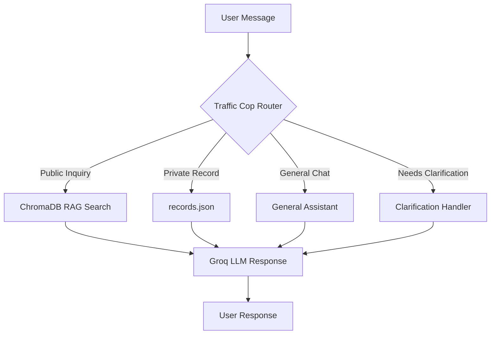

<div align="center">

# 🕊️ Memoria  
### *Mandaue City Municipal Public Cemetery Chatbot*


<br>


<br>

*A smart and secure cemetery information chatbot powered by Artificial Intelligence.*

</div>

---

## 📖 About the Project

**Memoria** is a chatbot inquiry system designed for the **Mandaue City Public Cemetery**.  
It helps citizens easily access public cemetery information and securely retrieve private burial records without needing to physically visit the cemetery office.

The system combines:

- 🤖 A **Retrieval-Augmented Generation (RAG) AI Assistant**
- 📱 A **Secure SMS OTP Login Portal**
- 🗺️ Smart burial record and plot monitoring
- 💬 Personalized conversational support

> [!IMPORTANT]
> This system is strictly for **human burial records and cemetery monitoring only**.  
> **No financial or payment transactions are handled by the system.**

---

# ✨ Main Features

<table>
<tr>
<td width="50%">

### 🤖 Memoria AI Assistant
An intelligent chatbot powered by **LangChain** and **Groq** that answers user questions based only on official cemetery documents.

</td>
<td width="50%">

### 🔐 Secure SMS OTP Login
Users can securely access private records using a **6-digit OTP** sent through the **TextBee API**.

</td>
</tr>

<tr>
<td width="50%">

### 🧠 Contextual Memory
The AI remembers previous conversations for logged-in users to create a smoother support experience.

</td>
<td width="50%">

### 🚦 Smart Routing System
The “Traffic Cop” engine automatically routes questions to the correct data source.

</td>
</tr>

<tr>
<td width="50%">

### 📱 Modern UI/UX
Mobile-responsive Glassmorphism interface with markdown rendering, typing indicators, and smooth animations.

</td>
<td width="50%">

### 🗂️ Private Record Access
Secure retrieval of burial records, lease expiration dates, and grave locations.

</td>
</tr>

</table>

---

# 🛠️ Tech Stack

<div align="center">

| Category | Technologies |
|---|---|
| **Backend** | Python, Flask, SQLite |
| **AI & RAG** | LangChain, ChromaDB, HuggingFace Embeddings, Groq API |
| **Frontend** | HTML, CSS, JavaScript |
| **Libraries** | DOMPurify, Marked.js |
| **SMS Gateway** | TextBee API |

</div>

---

# 🚀 Getting Started

## 📋 Prerequisites

Before running the system, make sure you have:

- ✅ Python **3.8+**
- ✅ A **Groq API Key**
- ✅ A **TextBee API Key**
- ✅ A **TextBee Device ID**

> [!NOTE]
> The project currently uses **Groq Cloud API** for fast AI responses.  
> You do **NOT** need Ollama unless you want to modify the project for full offline local AI support.

---

# 📦 Installation

## 1️⃣ Clone the Repository

```bash
git clone https://github.com/yourusername/memoria-rag-or-more.git
cd memoria-rag-or-more
```

---

## 2️⃣ Install Dependencies

```bash
pip install flask python-dotenv requests langchain langchain-chroma langchain-huggingface langchain-groq langchain-community sentence-transformers chromadb
```

---

## 3️⃣ Configure Environment Variables

Locate the `.env.example` file and duplicate it as:

```bash
.env
```

Then fill in your credentials:

```env
GROQ_API_KEY=your_groq_api_key_here
TEXTBEE_API_KEY=your_textbee_api_key_here
TEXTBEE_DEVICE_ID=your_textbee_device_id_here
```

---

## 4️⃣ Build the Knowledge Base

Run the ingestion script:

```bash
python ingest.py
```

This will:

- Read the files inside `docs/`
- Convert them into vector embeddings
- Store them in `chroma_db/`
- Vectorize existing chat history

---

## 5️⃣ Run the Application

```bash
python run.py
```

Open your browser and visit:

```text
http://127.0.0.1:5000
```

---

# 🏗️ Project Architecture

```text
Memoria/
│
├── run.py
├── ingest.py
├── records.json
├── .env
│
├── app/
│   ├── __init__.py
│   ├── database.py
│   ├── rag_engine.py
│   └── routes.py
│
├── docs/
│   └── memoria.txt
│
├── chroma_db/
├── memoria_chat.db
│
├── templates/
│   └── index.html
│
└── static/
    └── images/
        └── cityhall.jpg
```

---

# 📂 Core File Overview

## 🔹 Root Directory

| File | Purpose |
|---|---|
| `run.py` | Starts the Flask server and initializes SQLite |
| `ingest.py` | Builds the ChromaDB vector database |
| `records.json` | Mock private cemetery records |
| `.env` | Stores secure API keys |

---

## 🔹 Application Module (`app/`)

| File | Purpose |
|---|---|
| `__init__.py` | Creates the Flask application |
| `database.py` | Handles SQLite chat history |
| `rag_engine.py` | AI routing and RAG pipelines |
| `routes.py` | API routes and SMS OTP handling |

---

## 🔹 Data & Knowledge Base

| File/Folder | Purpose |
|---|---|
| `docs/memoria.txt` | Public cemetery information |
| `chroma_db/` | Vector database storage |
| `memoria_chat.db` | Chat memory database |

---

## 🔹 Frontend

| File | Purpose |
|---|---|
| `templates/index.html` | Main user interface |
| `static/images/cityhall.jpg` | UI visual assets |

---

# 🔒 Usage Guide

## 💬 Public Inquiries
Click the chat bubble and ask questions about:

- Cemetery requirements
- Office locations
- Operating hours
- General information

---

## 🔐 Secure Login

Click the **Portal / Login** button and enter a registered mobile number.

Example:

```text
09XXXXXXXXX
```

---

## 📲 OTP Verification

A **6-digit OTP** will be sent through **TextBee SMS**.

Enter the code in the verification modal to continue.

---

## 🪦 Access Private Records

Once logged in, users can ask about:

- Grave locations
- Burial records
- Plot availability
- Lease expiration dates

The AI securely retrieves information from the database while maintaining conversational context.

---

# 🧠 AI Workflow Overview



---

# 🔐 Security Features

- ✅ SMS OTP Authentication
- ✅ Private Record Protection
- ✅ API Key Isolation using `.env`
- ✅ Context-aware AI Restrictions
- ✅ Public and Private Data Separation

---

# 👨‍💻 Developers

Developed as an academic/project system for intelligent cemetery monitoring and AI-assisted public support.

---

<div align="center">

## 🌟 Thank You for Visiting Memoria

*"Preserving memories through technology."*

</div>
